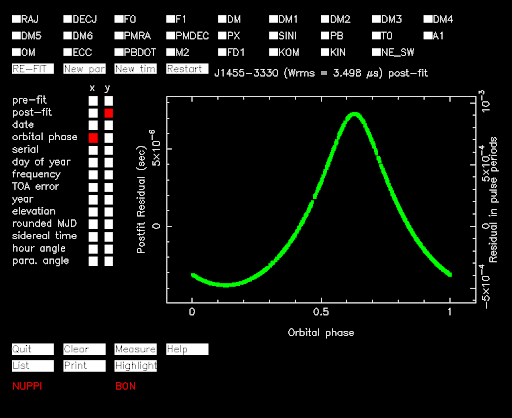
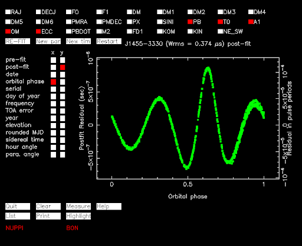

#### Example Shapiro delay campaign for J1455-3330

1. Use the best .par file (with Shapiro delay included) to simulate TOAs over 3 orbits `tempo2 -gr fake -f J1455-3330.par`
2. Turn shapiro delay off in par file. For ELL1H make h3 0 and stig 1
3. Run Tempo2 using the nofit command `tempo2 -gr plk -f J1455-3330.par J1455-3330.simulate -nofit`
Fit for all Keplerian parameters (PB,T0,OM,ECC,A1) and the orbital phase vs. residual will show the unabsorbed Shapiro delay signal. This will show the residuals obtained when the Shapiro delay is not included in the timing model. Parts of the delay visible in the left plot are absorbed in the fits for the Keplerian parameters. The clearly visible 'left-over' structure in the timing residuals represents the higher harmonics of Equation (8.42) and confirms the detection of the Shapiro delay (Lorimer and Kramer 2004).

   
   

4. Note down the corresponding MJD's for the crests and troughs of the unabsorbed Shapiro delay signal
5. Check the rise and set times of the pulsar on the noted MJD's and note down when it's visible
    

